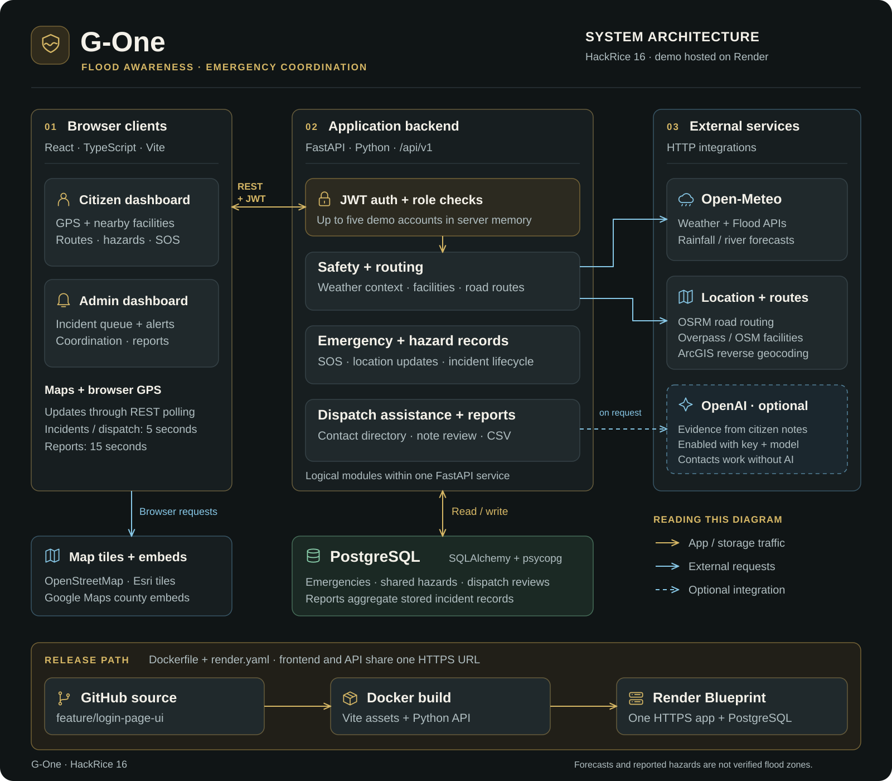

# G-One

**Flood awareness, evacuation planning, and emergency coordination.**

G-One connects people requesting help with responders managing the response.
Citizens can view location-based weather context, explore nearby facilities and
road routes, report hazards, and submit an SOS. Admins receive incident alerts,
review location-based emergency contacts, coordinate requests, and analyze saved
records. Built for **HackRice 16**.

## System architecture

[Open the diagram at full size](docs/diagrams/g-one-architecture.svg).
The diagram describes the implemented application and its Render deployment.
The demo is hosted at [g-one-app.onrender.com](https://g-one-app.onrender.com).

### How a request moves through G-One

1. **Sign in:** the backend verifies the account and returns a JWT. The frontend
   opens the citizen or responder dashboard based on the account's role.
2. **Build location context:** browser GPS provides coordinates; backend APIs
   retrieve weather and river forecasts, identify the location, and find nearby
   facilities and road routes.
3. **Request help:** the citizen submits an SOS with their reported location,
   help type, group size, notes, and available environmental context. The backend
   binds the record to the signed-in citizen and saves it to the database.
4. **Notify the admin:** the admin polls for new or changed incidents every five
   seconds. Dispatch assistance combines the saved request with a curated contact
   directory selected using the incident location. Optional AI can extract
   supporting evidence from the citizen's note.
5. **Coordinate the response:** responders assign requests, update their status,
   and review location changes. Dispatch review state is stored per responder and
   incident revision.
6. **Report the outcome:** Reports queries saved incident records, refreshes every
   15 seconds while visible, and supports filtering and CSV export. Seeded demo
   incidents are excluded from operational report totals.

### Components and responsibilities

| Component | Implementation | Responsibility |
| --- | --- | --- |
| Web application | React, TypeScript, Vite, React Router | Citizen and admin dashboards; browser GPS; REST polling |
| Maps | Leaflet; OpenStreetMap and Esri tiles; Google Maps county embeds | Map display, incident markers, reported hazards, and routes |
| API | FastAPI, Python, Pydantic | Authentication, validation, incidents, hazards, routing, dispatch, and reports |
| Access control | JWT; Argon2 password hashing; two in-memory demo accounts | Citizen record ownership and responder-only operations |
| Persistence | PostgreSQL, SQLAlchemy, psycopg | Emergencies, shared hazards, and dispatch reviews |
| Forecast context | Open-Meteo Weather and Flood APIs | Rainfall and modeled river-discharge forecasts |
| Location and routing | ArcGIS reverse geocoding, Overpass / OSM, OSRM | Place labels, nearby facilities, and road-route geometry |
| Optional AI | OpenAI Responses API, called by the backend | Structured note evidence; enabled with `OPENAI_API_KEY` and `DISPATCH_AI_MODEL` |
| Deployment | Docker and Render Blueprint | One web service serves the frontend and API; a separate managed PostgreSQL database stores records |

The backend is one application with logical API modules. It uses bounded
in-process caches for selected provider lookups and AI results. Browser maps load
tiles and embeds directly; some route-screening requests also call OSRM directly
from the browser. Live updates currently use HTTP polling.

### Accounts and concurrent use

The app has two roles, **citizen** and **worker**, with one configured demo
account per role. `InMemoryUserRepository` loads those accounts from server
configuration; user accounts are not currently stored in PostgreSQL. There is
no registration endpoint, and the Google/GitHub login buttons are not connected
to OAuth providers.

Multiple browser sessions can sign into a demo account, but those sessions share
the same user ID and access to that account's records. They do not represent
separate citizens or responders. Public multi-user access requires individual
accounts, an account-management flow, and validation of record isolation.
Capacity for 100 simultaneous users has not been load-tested.

### Data and demo scope

- **Stored records:** submitted SOS requests, incident updates, shared hazard
  reports, and dispatch reviews persist in the backend database. Local development
  can fall back to SQLite if PostgreSQL is unavailable; production requires the
  configured database.
- **External context:** weather and flood providers supply forecasts, not verified
  street-level flood boundaries. Shared hazards are user reports; nearby mapped
  facilities are not confirmed open shelters, and routes are not guaranteed safe.
- **Modeled dashboard context:** the Texas county overview contains labeled
  modeled/hybrid context. Operational reports use saved incident records.
- **Dispatch assistance:** curated US and Nepal directories supply contact
  numbers. Optional AI reviews note evidence; it does not generate phone numbers
  or automatically dispatch emergency services. Notifications and contacts work
  without an AI key.

## Deploy the HackRice demo

Follow [the Render setup guide](docs/DEPLOY_RENDER.md) on branch
`feature/login-page-ui`. The included `render.yaml` configures the React frontend
and FastAPI backend on one URL, with PostgreSQL for persistent incident records.

## Code map

| Path | Contents |
| --- | --- |
| [frontend/src/features/auth](frontend/src/features/auth) | Login and session handling |
| [frontend/src/features/dashboard](frontend/src/features/dashboard) | Citizen and responder interfaces, maps, API clients, and reports |
| [backend/app/api/v1](backend/app/api/v1) | REST endpoints for application features |
| [backend/app/services](backend/app/services) | Dispatch contact lookup and optional AI note review |
| [backend/app/core](backend/app/core) | Configuration, database, and security |
| [backend/tests](backend/tests) | Backend behavior, authorization, reporting, and deployment checks |
| [Dockerfile](Dockerfile) / [render.yaml](render.yaml) | Container build and hosting configuration |

The diagram is a self-contained SVG with no external image dependencies. To edit
its layout or labels, update [the generator](docs/diagrams/generate_architecture.py)
and run `python docs/diagrams/generate_architecture.py` from the repository root.
